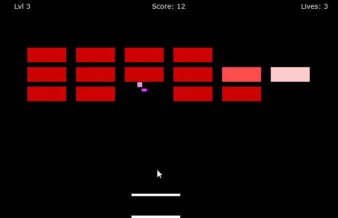

# Description
This project implements the game of Breakout.

### Running the Program

Main class: Run Main.java

Data files needed: Brick layouts for all 3 levels are located in a single file called 'brick_layouts.txt' in resources folder.

Key/Mouse inputs: On level startup, left click mouse to launch the bouncer. The paddle will translate to the x location of your mouse cursor.

Cheat keys: 
* 1, 2, 3 correspond to the levels 1-3
* L: increase lives by 1
* R: reset paddle and bouncer positions and pause game
* A: widen paddles
* B: slow down bouncers
* C: create and launch additional bouncer
* D: enable lasers
* E: speed up bouncers
